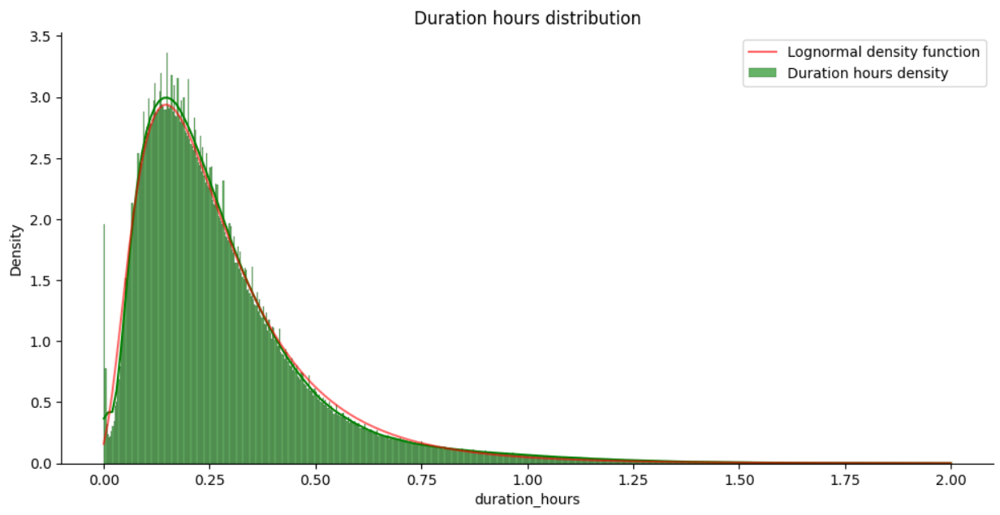

# Taxi-demand-predictor
An end-to-end pipeline of a machine-learning based product that predicts taxi demand in New York.  
The model will be adapted for the resources of a local machine.

## Contents
[About problem](#about-problem)  
[Exploratory data analysis](#eda)

## About problem
The task is to predict the approximate time and place of a next taxi order, using data from the past taxi demand.  
Data source: https://www.nyc.gov/site/tlc/about/tlc-trip-record-data.page  
(information about 'yellow taxi' trips is used)

## EDA
The data is extremely dirty, has a lot of missing and nonsensical values, such as negative ride costs and 0 passengers.  
The [notebook](https://github.com/Tukk0/Taxi-demand-predictor/blob/main/notebooks/EDA.ipynb) with explanations.  

After rigorous data cleaning process every feature was inspected by itself and cleaned of outliers.  
Kolmogorov-Smirnov and Anderson-Darling tests were used to come to the conclusion that the distribution of ride durations (in hours) is lognormal.  

In progress...
